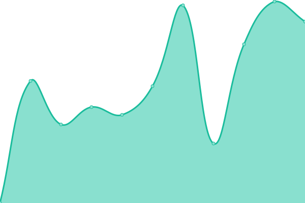

# [📈 Live Status](https://potapgoncharuk.github.io/profimon): <!--live status--> **🟩 All systems operational**

This repository contains the open-source uptime monitor and status page for [potapgoncharuk](https://potapgoncharuk.github.io/profimon), powered by [Upptime](https://github.com/upptime/upptime).

With [Upptime](https://upptime.js.org), you can get your own unlimited and free uptime monitor and status page, powered entirely by a GitHub repository. We use [Issues](https://github.com/potapgoncharuk/profimon/issues) as incident reports, [Actions](https://github.com/potapgoncharuk/profimon/actions) as uptime monitors, and [Pages](https://potapgoncharuk.github.io/profimon) for the status page.

<!--start: status pages-->
<!-- This summary is generated by Upptime (https://github.com/upptime/upptime) -->
<!-- Do not edit this manually, your changes will be overwritten -->
<!-- prettier-ignore -->
| URL | Status | History | Response Time | Uptime |
| --- | ------ | ------- | ------------- | ------ |
|  [Profi](https://profi-store.shop/) | 🟩 Up | [profi.yml](https://github.com/potapgoncharuk/profimon/commits/HEAD/history/profi.yml) | 

 1014ms
     
 | 

<a href="https://potapgoncharuk.github.io/profimon/history/profi">97.46%</a>
    

<!--end: status pages-->

[**Visit our status website →**](https://potapgoncharuk.github.io/profimon)

## 📄 License

- Powered by: [Upptime](https://github.com/upptime/upptime)
- Code: [MIT](./LICENSE) © [potapgoncharuk](https://potapgoncharuk.github.io/profimon)
- Data in the `./history` directory: [Open Database License](https://opendatacommons.org/licenses/odbl/1-0/)
